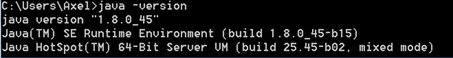

# oslc4j
##OSLC4J library of Eclipse Lyo for Java-based implementation of OSLC adapters

###Instructions to install OSLC4J 

Last updated by Axel Reichwein, February 15, 2016


####1. Installing the Java SE Development Kit (JDK) 8

1.	You can check if you have already installed the Java SE Development Kit 8 on your Windows machine by typing **java -version** in the command prompt window. Launch the command prompt by clicking on Start->All Programs-> Accessories-> Command Prompt. If Java SE Development Kit 8 is installed on your computer, the displayed java version will start with 1.8 as displayed in the figure below. You can also have other Java versions on your computer. No need to uninstall previous versions. You may have a version of Java 1.8 different than 1.8.0_45 installed on your machine.
<p align="center">
  
</p>

2.	If you do not the Java SE Development Kit 8 installed, go to  the following web page to install Java SE JDK 8 for different platforms: http://www.oracle.com/technetwork/java/javase/downloads/jdk8-downloads-2133151.html 
3.	Accept the license agreement for Java SE Development Kit 
4.	Choose the JDK for your platform (e.g. Windows )
Note: The JDK includes the Java Virtual Machine. 


####2. Downloading and installing Eclipse

1.	Download the latest Eclipse IDE for Java EE Developers at following web page: http://www.eclipse.org/downloads/packages/ 
2.	Unzip the downloaded Eclipse folder and place it at the location of your choice (e.g. under C:\Program Files)
3.	Create a folder which will be the workspace for your Eclipse projects. 
4.	Launch Eclipse
5.	Go to your Eclipse IDE installation directory,  open the eclipse folder and execute the eclipse.exe application
6.	Select the workspace folder for your Eclipse projects (the new folder you have created) as shown in the figure below.
 

####3. Installing the OSLC4J toolkit (projects of Eclipse Lyo adapted for Java 8)

EGit and Maven are already installed within the Eclipse for Java EE package.
The next steps are partly based on the [OSLC tutorial instructions](http://open-services.net/resources/tutorials/integrating-products-with-oslc/running-the-examples/) 

1.	In Eclipse, open the Git Repositories view. (Window → Show View → Other, search for Git repo by typing git in the search field, select the Git Repositories view among the search results, and click OK)
2.	Click Clone a Git Repository. 
3.	In the Clone Git Repository window, in the URI field paste the following: https://github.com/ld4mbse/oslc4j.git 
 (Warning: if you are using a proxy and if you get a Transport Error, check the troubleshooting section below)
4.	The Host and Repository fields will autofill. 
6.	Click Next.
7.	On the Branch Selection page, only select master and click Next.
8.	Specify the location of your Git repository on your local machine through the Destination field. For the Destination, select a directory of your choice or accept the default proposed by Eclipse as shown below. Make sure that the Git repository directory is not identical with your Eclipse workspace (workspace folder for your Eclipse projects) as defined in Step #3!
9.	Click Finish. oslc4j will appear in the Git Repositories view.
10.	In the Git Repositories view, right-click oslc4j and click Import Projects.
11.	In the Import Projects from Git Repository wizard, select Import existing projects and click Next. 
12.	Select all projects as in the figure below, and click Finish.
 
#####Troubleshooting

######Transport error

Proxy settings in Eclipse (this section is only necessary if you faced a Transport error at step 3 while cloning the git repository)
You may be using a proxy which Eclipse doesn’t know about. If that is the case, you will receive an error message as displayed below.

1. Go to Window->Preferences->General->Network Connection. Set Active Provider to manual.
2. Select the HTTPS schema entry, and click edit, and enter your proxy information.
3. Redo Task #3 in this installation step 


####4.	Setting the JRE of Eclipse

1.	In Eclipse, open the Preference view (Window->Preferences). 
2.	Under Java, select the Installed JREs tab. 
3.	Click on Add, select Standard VM and click Next, then click on Directory… and select the Java JDK 8 installation directory (not the JRE directory) as your JRE home as displayed in the images below.
4.	Mark jdk8 as your installed JRE, as in the figure below, and click OK. Make sure not to select jre8 as installed JRE. If you do, Maven will not be able to compile Maven projects, including the OSLC4J projects, because it will be unable to locate the Java compiler tool.


####5.	Building the OSLC4J projects

1.	Expand the org.eclipse.lyo.oslc4j.build project by clicking on the arrow situated at the left of the project name
2.	Right click pom.xml -> Run As -> Maven clean
3.	Right click pom.xml -> Run As -> Maven install. This procedure may take 1-2 minutes. Maven will download many dependent libraries and then compile the OSLC4J projects. 
The console window in the middle of the Eclipse IDE should display a success message when Maven install is finished. If there is no error mark next to any project, you can skip the next tasks. The installation of OSLC4J from Eclipse Lyo was successful.

 
#####Troubleshooting

######Configuring OSLC4J projects in Eclipse

If a project still shows an error, then change its JDK compliance to 1.8. Select the project, right-click -> Properties. Select Java Compiler and select 1.8 in the drop down menu.

1.	In Eclipse, open the Preference view (Window->Preferences). 
2.	Under Java, select the Compiler tab. 
3.	Make sure that the Compiler compliance level is set to 1.8 as shown below
4.	In Eclipse, open the Project Explorer view. (Window → Show View → Project Explorer). The view should be displayed in the top left corner in your Eclipse IDE. If you do not see it, the view is in “collapsed mode”. Click on the overlapped folder icon and you will see the project explorer view.
5.	Perform following steps for all projects  except the project “org.eclipse.lyo.oslc4j.build” 
 1.	Right-click on the project in the project view and select Properties
 2.	Select the Java Compiler tab, and remove the mark in the checkbox named “Enable project-specific settings”, and click Apply. If requested to rebuild the project, accept by clicking on Yes.
 3.	In the same properties window, select the Project Facets tab, and set the Java version to 1.8
 4.	Click OK at the bottom right of the properties window. 
 5.	Select the pom.xml tab, at the bottom of the editor window and make sure that the version of the source and target version of the configuration of maven-compiler-plugin is set to 1.8, as shown below above. This maven-compiler-plugin would otherwise use by default a Java 5 compiler to build the Java code. If necessary, add the <configuration> element to the definition of the maven-compiler-plugin, as shown below.
```xml
   <plugin>
                <groupId>org.apache.maven.plugins</groupId>
                <artifactId>maven-compiler-plugin</artifactId>
                <version>2.3.2</version>
                <configuration>
                    <source>1.8</source>
                    <target>1.8</target>
                </configuration>
  	</plugin>
```
 

######Proxy settings

Proxy settings in Maven (this section is only necessary if you faced a compile error at step 4)
You may be using a proxy which Maven doesn’t know about. If that is the case, you will receive an error message include following text:
**[ERROR] Failed to execute goal on project …: Could not resolve dependencies for project …: Failed to read artifact descriptor for …: Could not transfer artifact .. from/to central (http://repo.maven.apache.org/maven2): connection timed out to … -> [Help 1]**
Check first with your system administrator to see if there is a Maven settings.xml file for your specific organization. If not, create a text file named settings.xml and copy following contents into the file:
```xml
<settings>
  	<proxies>
  	 <proxy>
      	<active>true</active>
      	<protocol>http</protocol>
      	<host>proxy.somewhere.com</host>
     	 <port>8080</port>
      	<username>proxyuser</username>
    	  <password>somepassword</password>
   	 </proxy>
 	 </proxies>
</settings>
```
Enter your proxy information in the placeholders and save the file. Place the settings.xml file in your Maven directory which is typically located at <user home>/.m2/. Your settings.xml file will for example be placed at “C:\Users\Axel\.m2\settings.xml”.
In Eclipse, Window->Preferences->Maven->User Settings, make sure that the path to the settings.xml file is correctly defined. Click on Update Settings.

